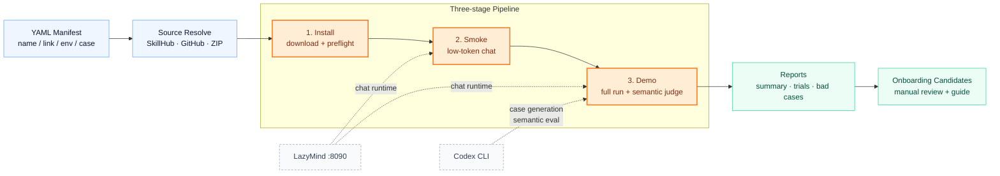

# skill-auto

[English](README.md) | [中文](README.zh-CN.md)

`skill-auto` is a LazyMind Skill automation framework. It is used to batch test
third-party Skills, record whether they can be installed and executed in
LazyMind, classify failures, and produce reproducible trial reports.

Skill onboarding is intentionally documentation-driven. The framework can
produce onboarding candidates, but production onboarding should follow
[`docs/SKILL_ONBOARDING_GUIDE.md`](docs/SKILL_ONBOARDING_GUIDE.md) and be applied
to the LazyMind repository after reviewing the test report.

## Framework Overview



## What It Does

- Downloads or resolves Skill sources from SkillHub, GitHub, or ZIP links.
- Runs static/install checks before spending chat tokens.
- Tests Skills against a local LazyMind service through the API runner.
- Supports three-stage batch testing: install, smoke, demo.
- Generates demo cases with the local Codex model in small batches.
- Allows manifest-level custom cases and per-Skill environment variables.
- Records trigger status, execution status, failure reasons, retry behavior, and
  onboarding recommendations.
- Uses semantic Codex judging in demo mode to reduce false negatives from simple
  rule matching.

## Quick Start

For a simple end-to-end user guide, read
[`docs/USER_GUIDE.md`](docs/USER_GUIDE.md).

Run from the project root:

```bash
cd /Users/chenzhe1/Public/WorkDir/skill-auto
python3 -m skill_auto pipeline \
  --manifest manifests/skills.example.yaml \
  --base-url http://127.0.0.1:8090
```

Reports are written automatically to a timestamped directory when `--out` is not
provided:

```text
reports/<manifest-name>-pipeline-YYYYMMDD-HHMMSS/
```

For a single-stage demo run:

```bash
python3 -m skill_auto test \
  --manifest manifests/skills.example.yaml \
  --runner api \
  --base-url http://127.0.0.1:8090 \
  --mode demo \
  --attempts 2 \
  --max-response-chars 0
```

`skill-auto` is also exposed as a console script when installed:

```bash
skill-auto test --manifest manifests/skills.example.yaml
```

## Manifest Format

The daily input can stay small. `name` and `link` are required.

```yaml
schema_version: 1
batch_id: skill-candidates-001

skills:
  - name: weather
    link: https://skillhub.cn/skills/clawhub_steipete/weather

  - name: humanizer
    link: https://skillhub.cn/skills/user_ab5ae6ee/unclecheng-reduce-ai-perception-v2
```

### Optional Case

Use `case` when you want to control the exact smoke/demo prompt. When `case` is
present, the framework uses it directly and does not generate a case for that
Skill.

```yaml
skills:
  - name: humanizer
    link: https://skillhub.cn/skills/user_ab5ae6ee/unclecheng-reduce-ai-perception-v2
    case: >
      请使用 humanizer Skill，把下面这段公众号开头改得更像真人作者写的，
      保留原意，不要太口语化。
```

For multiple cases, use `test_cases`:

```yaml
skills:
  - name: report-skill
    link: https://github.com/example/report-skill
    test_cases:
      - id: core-flow
        prompt: 请使用 report-skill Skill，把这组销售数据整理成周报摘要。
      - id: edge-case
        prompt: 请使用 report-skill Skill，处理一组包含缺失值的销售数据。
```

### Optional Env

Environment variables are read from the manifest item only. `env` is optional;
omit it when the Skill does not need credentials. When `env` is non-empty,
`skill-auto` prepends those values to that Skill's chat case and redacts the
values from saved observations.

Mapping style:

```yaml
skills:
  - name: wechat-cover
    link: https://skillhub.cn/skills/user_8d36cde0/wechat-cover
    env:
      REDFOX_API_KEY: your_redfox_api_key_here
```

List style:

```yaml
skills:
  - name: summarize
    link: https://skillhub.cn/skills/clawhub_paudyyin/summarize
    env:
      - OPENAI_API_KEY=your_openai_api_key_here
      - OPENAI_BASE_URL=https://api.example.com/v1
```

Do not put real keys in committed manifests. Use placeholders such as
`your_github_token_here` before sharing the project.

## Recommended Batch Strategy

For large lists, use the three-stage strategy to reduce token cost.

Stage 1: install/static check. This does not run chat.

```bash
python3 -m skill_auto test \
  --manifest manifests/top100.yaml \
  --runner api \
  --base-url http://127.0.0.1:8090 \
  --mode install \
  --run-chat false \
  --between-skill-delay 0
```

Stage 2: smoke check only install-passed Skills.

```bash
python3 -m skill_auto test \
  --manifest reports/top100-install-YYYYMMDD-HHMMSS/install_passed.yaml \
  --runner api \
  --base-url http://127.0.0.1:8090 \
  --mode smoke \
  --attempts 1 \
  --max-response-chars 500 \
  --between-skill-delay 10
```

Stage 3: demo check only smoke-passed candidates.

```bash
python3 -m skill_auto test \
  --manifest reports/top100-smoke-YYYYMMDD-HHMMSS/smoke_passed.yaml \
  --runner api \
  --base-url http://127.0.0.1:8090 \
  --mode demo \
  --attempts 2 \
  --max-response-chars 0 \
  --demo-case-generator codex \
  --demo-case-batch-size 5 \
  --between-skill-delay 30
```

Or run the same staged flow with one command:

```bash
python3 -m skill_auto pipeline \
  --manifest manifests/top100.yaml \
  --base-url http://127.0.0.1:8090
```

Pipeline output:

```text
reports/top100-pipeline-YYYYMMDD-HHMMSS/
  01-install/
    install_passed.yaml
  02-smoke/
    smoke_passed.yaml
  03-demo/
    onboarding_candidates.yaml
```

## Demo Case Generation

Demo mode defaults to Codex-generated cases:

```bash
--demo-case-generator codex
--demo-case-batch-size 5
```

The generator reads each downloaded `SKILL.md`, groups Skills into batches, and
asks the local Codex model to return:

```json
{"cases":[{"name":"skill-name","id":"core-flow","prompt":"..."}]}
```

Generation rules:

- one case per input Skill
- exact `name` match
- prompt must mention `请使用 <name> Skill`
- prompt must be self-contained and no longer than 300 Chinese characters
- no dependency on local files, localhost, private networks, current projects, or
  user accounts
- no request for the user to provide API keys, tokens, payment, or login
- product/file-generating Skills should explicitly ask for the expected artifact
  and require a returned file path or attachment link

Invalid batch cases are repaired one by one with Codex. If repair also fails,
the runner falls back to static templates. Use static generation when you want
to avoid Codex case-generation tokens:

```bash
--demo-case-generator static
```

Useful environment variables:

```text
SKILL_AUTO_CODEX_BIN              Override the codex executable.
SKILL_AUTO_CASE_TIMEOUT           Case-generation timeout, default 90 seconds.
SKILL_AUTO_CASE_MAX_CHARS         Generated case max length, default 300.
SKILL_AUTO_BATCH_SKILL_BRIEF_CHARS Characters of each SKILL.md included in batch prompts.
```

## Judgement Logic

Smoke mode uses rule-based judgement. Demo mode uses semantic Codex judging by
default, with rule-based results retained in each observation as
`rule_skill_trigger_status` and `rule_skill_execution_status` when semantic
judging overrides them.

Important fields:

```text
skill_trigger_status: confirmed | requested_only | not_triggered | unclear | not_tested
skill_triggered: true | false
skill_execution_status: success | degraded | blocked | failed | not_tested
skill_execution_evidence: evidence used for the execution judgement
failure_category: normalized failure category
semantic_eval_status: succeeded | partial | failed | not_tested
```

Execution status means:

- `success`: the Skill was confirmed as triggered and completed the requested
  task with a checkable result. Attachments are not required unless the case or
  Skill type explicitly requires an artifact.
- `degraded`: the Skill was triggered and produced useful output, but part of
  the core path failed or it used a weaker fallback.
- `blocked`: execution was stopped by missing env/API keys, auth, permissions,
  dependencies, model rate limiting, or other external blockers.
- `failed`: the Skill did not produce a usable or checkable result after all
  attempts.
- `not_tested`: chat or semantic execution was intentionally skipped, or model
  rate limiting exhausted the retry budget with pass-through enabled.

Semantic judging can be disabled:

```bash
SKILL_AUTO_SEMANTIC_EVAL=false python3 -m skill_auto test ...
```

Useful semantic settings:

```text
SKILL_AUTO_SEMANTIC_EVAL_TIMEOUT  Codex semantic judgement timeout, default 180 seconds.
```

## Retry, Rate Limit, And Waiting

`--attempts` controls normal chat tries per test case. The runner stops early
when an attempt passes, keeps every attempt in `chat_observations`, and marks
retry-pass cases as `flaky`.

Rate-limit handling is separate from normal retries:

```text
--retry-delay 30
--retry-backoff 3
--rate-limit-attempts 3
--rate-limit-delay 120
--rate-limit-backoff 2
--rate-limit-pass-through true
--between-skill-delay 30
```

When LazyMind returns rate-limit text such as `请求过于频繁` or `触发限流`, the
runner waits with exponential backoff and retries. If every rate-limit retry is
exhausted and pass-through is enabled, the run records
`failure_category=model_rate_limited_passed` and
`skill_execution_status=not_tested`, so infrastructure throttling is not counted
as a Skill bad case.

LazyMind chat completion waiting is status-based:

1. Submit `/api/core/conversations:chat`.
2. Poll `/api/core/conversations/{conversation_id}:status`.
3. Continue while `is_generating=true`.
4. After generation stops, read
   `/api/core/conversations/{conversation_id}:history?page_size=1`.
5. Check terminal fields such as `run_terminal.status` and `run_status`.
6. Extract attachments, run semantic judgement in demo mode, then classify the
   attempt.

Useful timeout settings:

```text
SKILL_AUTO_CHAT_TIMEOUT              Single chat stream timeout, default 900 seconds.
SKILL_AUTO_STATUS_POLL_TIMEOUT       Status polling timeout, defaults to chat timeout.
SKILL_AUTO_STATUS_POLL_INTERVAL      Status polling interval, default 5 seconds.
SKILL_AUTO_HISTORY_TERMINAL_TIMEOUT  Extra history terminal wait, default 60 seconds.
SKILL_AUTO_HISTORY_POLL_INTERVAL     History polling interval, default 2 seconds.
```

## Outputs

Each run writes:

```text
reports/<run-id>/
  skill_trials.jsonl
  summary.md
  onboarding_candidates.yaml
  install_passed.yaml
  smoke_passed.yaml
  bad_cases.yaml
  bugs.md
  artifacts/
  logs/
```

`skill_trials.jsonl` is the source of truth. It contains installability,
runnability, generated cases, chat observations, semantic judgement, failure
reasons, quality scores, retry/flaky markers, and onboarding recommendation.

`summary.md` is the human-readable batch summary.

`install_passed.yaml` is intended as input for smoke checks.

`smoke_passed.yaml` is intended as input for demo checks. In smoke mode it is
trigger-oriented: a Skill can enter demo when it installed, produced a chat
response, confirmed Skill triggering, and did not hit a hard blocker. Weak smoke
execution evidence is preserved as `smoke_risk` instead of always blocking demo.

`bad_cases.yaml` and `bugs.md` collect actionable failures. Repeated model
rate-limit pass-through is intentionally excluded from bad cases.

`onboarding_candidates.yaml` lists Skills recommended for onboarding after
successful testing.

## Scheduling

Create a one-time macOS `launchd` run:

```bash
python3 -m skill_auto schedule \
  --at "14:30" \
  --manifest manifests/skills.example.yaml \
  --base-url http://127.0.0.1:8090 \
  --username admin \
  --password admin \
  --attempts 2 \
  --install-launchd
```

Use `--manifest` for normal work. Repeated `--skill name=url` is only a small
convenience for quick ad hoc schedules. Without `--install-launchd`, the command
only writes the generated manifest, runner script, and plist under `schedules/`.

Do not share generated launchd scripts if they contain local credentials.

## Onboarding

Production onboarding is manual and guide-driven:

```bash
open docs/SKILL_ONBOARDING_GUIDE.md
```

The deprecated `onboard` command is kept for experiments and manifest resolving
only. Do not use it as the default production path.

```bash
python3 -m skill_auto onboard --manifest manifests/onboarding.yaml --resolve-only
```

Older preview/apply commands still exist, but should be treated as experimental:

```bash
python3 -m skill_auto onboard --manifest manifests/onboarding.yaml --dry-run
python3 -m skill_auto onboard --manifest manifests/onboarding.yaml --apply --lazymind-root /path/to/LazyMind
```

## Development

Run tests:

```bash
python3 -m unittest discover -s tests -p 'test_*.py'
```

Current covered areas include:

- manifest parsing
- downloader/source resolution
- preflight checks and env-key detection
- env injection/redaction
- retry and judgement helpers
- demo case generation parsing, validation, batch repair, and fallback
- semantic judgement normalization and application
- onboarding manifest resolution and writers
