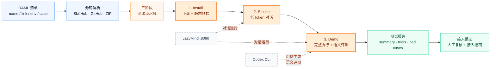

# skill-auto

[English](README.md) | [中文](README.zh-CN.md)

`skill-auto` 是一个面向 LazyMind 的 Skill 自动化测试框架，用于批量测试第三方 Skill，记录它们是否能安装、是否能在 LazyMind 中被触发和执行、失败原因是什么，以及是否建议进入后续接入流程。

Skill 接入采用“文档驱动”的方式：`skill-auto` 会产出候选清单和测试证据，但正式接入 LazyMind 仓库时，应先查看测试报告，再按 [`docs/SKILL_ONBOARDING_GUIDE.md`](docs/SKILL_ONBOARDING_GUIDE.md) 手动修改和验证。

## 框架概览



## 核心能力

- 支持从 SkillHub、GitHub、ZIP 链接解析或下载 Skill。
- 先做安装和静态检查，避免一开始就消耗大量 chat token。
- 通过 LazyMind API runner 在本地 LazyMind 服务中试用 Skill。
- 支持三阶段批量测试：`install`、`smoke`、`demo`。
- demo 阶段可使用本机 Codex CLI 批量生成贴合 Skill 的测试用例。
- 支持在 YAML 中给单个 Skill 配置 `case`、`test_cases` 和 `env`。
- 记录触发状态、执行状态、失败分类、重试情况和接入建议。
- demo 阶段默认使用 Codex 做语义级评测，降低简单规则误判。

## 快速开始

更完整的上手说明见 [`docs/USER_GUIDE.md`](docs/USER_GUIDE.md)。

在项目根目录运行：

```bash
cd /path/to/skill-auto
python3 -m skill_auto pipeline \
  --manifest manifests/skills.example.yaml \
  --base-url http://127.0.0.1:8090
```

未传 `--out` 时，报告会自动写入带时间戳的目录：

```text
reports/<manifest-name>-pipeline-YYYYMMDD-HHMMSS/
```

单独跑 demo 阶段：

```bash
python3 -m skill_auto test \
  --manifest manifests/skills.example.yaml \
  --runner api \
  --base-url http://127.0.0.1:8090 \
  --mode demo \
  --attempts 2 \
  --max-response-chars 0
```

如果已安装为命令行工具，也可以使用：

```bash
skill-auto test --manifest manifests/skills.example.yaml
```

## 使用前准备

先启动 LazyMind Docker 服务，并确认网页端可以访问：

```text
http://127.0.0.1:8090
```

建议先手动打开网页，确认可以登录并进入聊天页面。默认本地环境常用账号是：

```text
账号：admin
密码：admin
```

demo 阶段还依赖本机 Codex CLI 生成用例和做语义评测：

```bash
codex login
codex doctor
codex --help
```

如果只想低成本检查安装和基础触发，可以先跑 install/smoke，或者把 demo 用例生成切到静态模板：

```bash
--demo-case-generator static
```

## YAML 清单格式

日常测试清单建议放在 `manifests/` 目录。`name` 和 `link` 是必填字段。

```yaml
schema_version: 1
batch_id: skill-candidates-001

skills:
  - name: weather
    link: https://skillhub.cn/skills/clawhub_steipete/weather

  - name: humanizer
    link: https://skillhub.cn/skills/user_ab5ae6ee/unclecheng-reduce-ai-perception-v2
```

### 可选 case

如果你希望固定测试文案，可以给单个 Skill 写 `case`。写了 `case` 后，框架会直接使用它，不再为这个 Skill 生成用例。

```yaml
skills:
  - name: weather
    link: https://skillhub.cn/skills/clawhub_steipete/weather
    case: 请使用 weather Skill 查询上海明天的天气，并给出通勤穿衣建议。
```

多个用例使用 `test_cases`：

```yaml
skills:
  - name: humanizer
    link: https://skillhub.cn/skills/user_ab5ae6ee/unclecheng-reduce-ai-perception-v2
    test_cases:
      - id: core-flow
        prompt: 请使用 humanizer Skill，把这段公众号开头改得更像真人作者写的。
      - id: business-style
        prompt: 请使用 humanizer Skill，把这段产品介绍改得更自然可信。
```

### 可选 env

环境变量只从 YAML 的 `env` 字段读取，不再使用 `env.sh`。`env` 是可选字段，不需要凭证的 Skill 可以不写。

```yaml
skills:
  - name: wechat-cover
    link: https://skillhub.cn/skills/user_8d36cde0/wechat-cover
    env:
      REDFOX_API_KEY: your_redfox_api_key_here
```

多个环境变量：

```yaml
skills:
  - name: summarize
    link: https://skillhub.cn/skills/clawhub_paudyyin/summarize
    env:
      OPENAI_API_KEY: your_openai_api_key_here
      OPENAI_BASE_URL: https://api.example.com/v1
      OPENAI_USE_CHAT_COMPLETIONS: "1"
      SUMMARIZE_MODEL: openai/example-model
```

注意不要把真实 key 提交到 GitHub。分享 YAML 前，把真实值替换成 `your_xxx_here` 这类占位符。

## 推荐批量测试策略

大批量测试时推荐三阶段执行，减少 token 消耗。

第一阶段：安装和静态检查，不跑 chat。

```bash
python3 -m skill_auto test \
  --manifest manifests/top100.yaml \
  --runner api \
  --base-url http://127.0.0.1:8090 \
  --mode install \
  --run-chat false \
  --between-skill-delay 0
```

第二阶段：只对安装通过的 Skill 跑 smoke。

```bash
python3 -m skill_auto test \
  --manifest reports/top100-install-YYYYMMDD-HHMMSS/install_passed.yaml \
  --runner api \
  --base-url http://127.0.0.1:8090 \
  --mode smoke \
  --attempts 1 \
  --max-response-chars 500 \
  --between-skill-delay 10
```

第三阶段：只对 smoke 通过的候选 Skill 跑 demo。

```bash
python3 -m skill_auto test \
  --manifest reports/top100-smoke-YYYYMMDD-HHMMSS/smoke_passed.yaml \
  --runner api \
  --base-url http://127.0.0.1:8090 \
  --mode demo \
  --attempts 2 \
  --max-response-chars 0 \
  --demo-case-generator codex \
  --demo-case-batch-size 5 \
  --between-skill-delay 30
```

也可以一条命令跑完整 pipeline：

```bash
python3 -m skill_auto pipeline \
  --manifest manifests/top100.yaml \
  --base-url http://127.0.0.1:8090
```

## Demo 用例生成

demo 阶段默认使用 Codex 生成用例：

```bash
--demo-case-generator codex
--demo-case-batch-size 5
```

Codex 会读取下载后的 `SKILL.md`，按批次生成 JSON：

```json
{"cases":[{"name":"skill-name","id":"core-flow","prompt":"..."}]}
```

生成规则：

- 每个 Skill 生成 1 条 case。
- `name` 必须和输入清单完全一致。
- prompt 必须提到 `请使用 <name> Skill`。
- prompt 必须自包含，不超过 300 个中文字符。
- 不依赖本地文件、localhost、内网、当前项目或用户私有账号。
- 不要求用户在对话里再提供 API key、token、登录或付费操作。
- 产物型 Skill 应明确要求生成对应文件，并返回文件名、路径或附件链接。

如果批量生成失败或格式不合法，会自动单条补救；补救也失败时，回退到静态模板。

相关环境变量：

```text
SKILL_AUTO_CODEX_BIN              指定 codex 可执行文件。
SKILL_AUTO_CASE_TIMEOUT           用例生成超时时间，默认 90 秒。
SKILL_AUTO_CASE_MAX_CHARS         生成用例长度上限，默认 300。
SKILL_AUTO_BATCH_SKILL_BRIEF_CHARS 每个 SKILL.md 放入批量 prompt 的字符数。
```

## 判断逻辑

Smoke 阶段使用规则判断。Demo 阶段默认使用 Codex 做语义评测；如果语义评测覆盖了规则结果，原规则结果会保存在每条 observation 的 `rule_skill_trigger_status` 和 `rule_skill_execution_status` 中。

关键字段：

```text
skill_trigger_status: confirmed | requested_only | not_triggered | unclear | not_tested
skill_triggered: true | false
skill_execution_status: success | degraded | blocked | failed | not_tested
skill_execution_evidence: 执行判断证据
failure_category: 失败分类
semantic_eval_status: succeeded | partial | failed | not_tested
```

执行状态含义：

- `success`：确认触发 Skill，并完成用户任务，结果可检查。除非 case 或 Skill 类型明确要求附件，否则没有附件不自动算失败。
- `degraded`：Skill 被触发并产出有用结果，但核心脚本/工具路径部分失败，或走了较弱的降级路径。
- `blocked`：被缺少 env/API key、登录、权限、依赖、模型限流等外部因素阻塞。
- `failed`：多次尝试后仍没有产出可用、可验收的结果。
- `not_tested`：没有执行 chat/语义评测，或模型限流重试耗尽后以 pass-through 方式记录。

关闭语义评测：

```bash
SKILL_AUTO_SEMANTIC_EVAL=false python3 -m skill_auto test ...
```

## 重试、限流和等待

普通重试由 `--attempts` 控制。某次重试通过时，记录会标记为 `flaky=true`。

常用参数：

```text
--retry-delay 30
--retry-backoff 3
--rate-limit-attempts 3
--rate-limit-delay 120
--rate-limit-backoff 2
--rate-limit-pass-through true
--between-skill-delay 30
```

当 LazyMind 返回 `请求过于频繁`、`触发限流` 等信息时，框架会按退避策略等待后重试。如果限流重试仍耗尽，并且开启 pass-through，会记录为：

```text
failure_category=model_rate_limited_passed
skill_execution_status=not_tested
```

这样不会把平台限流误算成 Skill 自身失败。

LazyMind 对话等待采用状态轮询：

1. 提交 `/api/core/conversations:chat`。
2. 轮询 `/api/core/conversations/{conversation_id}:status`。
3. 只要 `is_generating=true` 就继续等待。
4. 生成结束后读取 `/api/core/conversations/{conversation_id}:history?page_size=1`。
5. 检查 `run_terminal.status`、`run_status` 等终态字段。
6. 提取附件、进行 demo 语义评测、分类结果。

常用超时配置：

```text
SKILL_AUTO_CHAT_TIMEOUT              单次 chat stream 超时，默认 900 秒。
SKILL_AUTO_STATUS_POLL_TIMEOUT       状态轮询超时，默认等于 chat timeout。
SKILL_AUTO_STATUS_POLL_INTERVAL      状态轮询间隔，默认 5 秒。
SKILL_AUTO_HISTORY_TERMINAL_TIMEOUT  history 终态额外等待，默认 60 秒。
SKILL_AUTO_HISTORY_POLL_INTERVAL     history 轮询间隔，默认 2 秒。
```

## 输出结果

每次运行会生成：

```text
reports/<run-id>/
  skill_trials.jsonl
  summary.md
  onboarding_candidates.yaml
  install_passed.yaml
  smoke_passed.yaml
  bad_cases.yaml
  bugs.md
  artifacts/
  logs/
```

建议优先看：

- `summary.md`：本轮测试简表。
- `skill_trials.jsonl`：最完整的机器记录，是结果源文件。
- `bad_cases.yaml`：失败 Skill 和失败原因。
- `bugs.md`：按问题整理的失败说明。
- `onboarding_candidates.yaml`：建议进入接入流程的候选 Skill。

## 定时任务

macOS 上可以创建一次性 `launchd` 定时任务：

```bash
python3 -m skill_auto schedule \
  --at "14:30" \
  --manifest manifests/skills.example.yaml \
  --base-url http://127.0.0.1:8090 \
  --username admin \
  --password admin \
  --attempts 2 \
  --install-launchd
```

注意：

- `--username` 和 `--password` 会写入本机生成的调度脚本。
- 不要分享或提交 `schedules/` 目录。
- 当前仓库 `.gitignore` 已默认忽略 `schedules/`。

## 接入说明

正式接入 LazyMind 时，先看测试报告，再按接入说明操作：

```bash
open docs/SKILL_ONBOARDING_GUIDE.md
```

旧的 `onboard` 命令仍保留用于实验和 manifest resolve，但不建议作为生产接入默认方式：

```bash
python3 -m skill_auto onboard --manifest manifests/onboarding.yaml --resolve-only
```

## 开发

运行测试：

```bash
python3 -m unittest discover -s tests -p 'test_*.py'
```

当前测试覆盖：

- manifest 解析
- source 下载和解析
- preflight 与环境变量检测
- env 注入和脱敏
- 重试和判断辅助逻辑
- demo case 生成、校验、批量补救和回退
- 语义评测归一化和应用
- onboarding manifest resolve 和 writer
